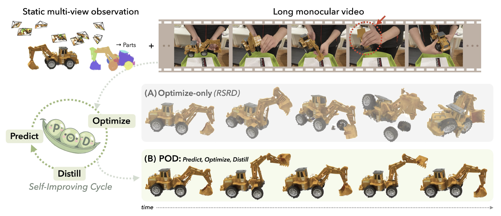
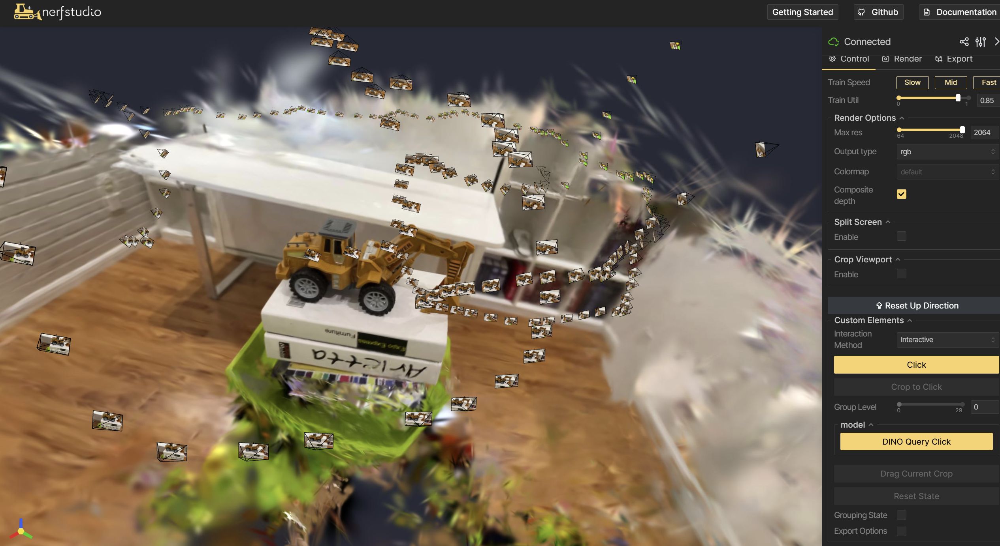
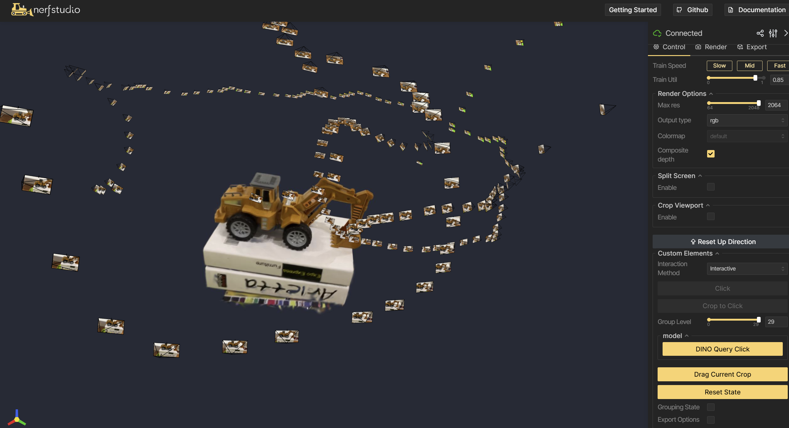
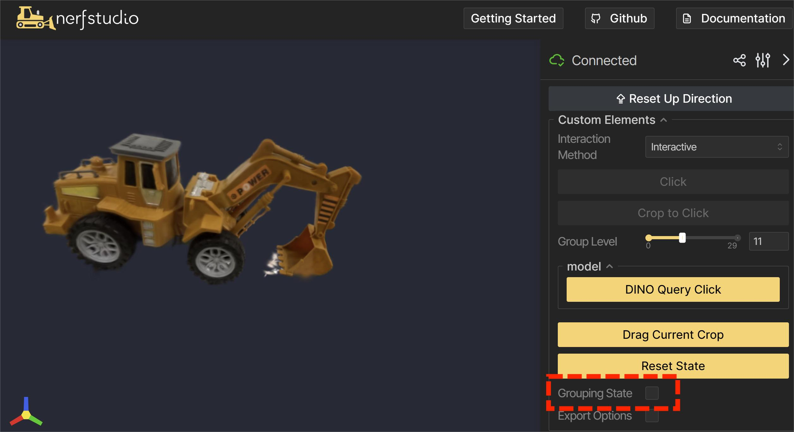
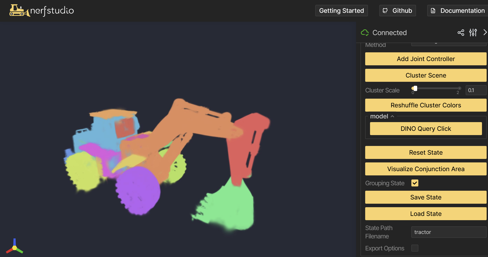

#  POD : Predict-Optimize-Distill   
Predict-Optimize-Distill: A Self-Improving Cycle for 4D Object Understanding 


# Environment Setup
```
git clone --recursive https://github.com/Mingxuan-W/pod.git
```

## Create conda environment
``` 
- conda create --name pod -y python=3.10 
- conda activate pod
- pip install torch==2.1.2+cu118 torchvision==0.16.2+cu118 --extra-index-url https://download.pytorch.org/whl/cu118
- pip install nerfstudio
- pip install numpy==1.26.4
- conda install -c "nvidia/label/cuda-11.8.0" cuda-toolkit
- pip install ninja git+https://github.com/NVlabs/tiny-cuda-nn/#subdirectory=bindings/torch
```

## Install  [GARField](https://github.com/chungmin99/garfield)
```
- cd dependencies/garfield
- pip install --extra-index-url=https://pypi.nvidia.com cudf-cu12==24.2.2 cuml-cu12==24.2.0  cupy==13.3.0
- pip install -e.
```

## Install dig
```
- cd dependencies/dig
- pip install -e.
```

## Install pod
```
- pip install -e.
```

# Running POD

## 1. Object Selection ( Slightly different from [RSRD](https://github.com/kerrj/rsrd))
  POD consists of two overlaid models: a GARField and a dino-embedded gaussian model (which we call DiG)
  
  1) *Train GARField* with `ns-train garfield --data <path/to/datasetname>`. This will produce an output config file inside `output/datasetname/garfield/<timestamp>/config.yml`
  2) *Train DiG* with `ns-train dig --data <path/to/data/directory> --pipeline.garfield-ckpt <path/to/config.yml>`, using the output config file from the GARField training.
  3) *Segment the model*: inside the viewer for DiG, you should see the following GUI:
  
  First we need to segment the model. To do this, click on the "Click" button, then click inside the viewer window to select a point in 3D. Next, click "Crop to Click". You should see a result like this:
  
  Next adjust the group level until only the object is segmented, like this:
  
  Check the "Grouping State" box, type the the ```object + name_rgb``` for rgb file like ```tractor_rgb```, then click "Save State" button.
  
  Finally, switch to "Cluster" mode, then click "Cluster Scene". For best results pick a scale such that the fewest parts are segmented, with just the part of interest remaining. You can cluster as many times as you want, the final clusters are saved for use in the motion recovery stage of the pipeline.Type the the object name for rgb file like ```tractor```, then click "Save State" button.
  
  All the saved .pt files are inside ```state``` folder. For every object , we need two state files (eg. ```tractor.pt``` and ```tractor_rgb.pt```)
## 2. RSRD Init
Now we can set the object related config file info inside the ``` pod/config/training_config.py ```
prepare video dataset
the dataset format will look like this
```
video/
├── tractor/
│   ├── tractor_0.mp4            
│   ├── masks/
│   │   ├── tractor_0/           
```

``` 
- python scripts/run_rsrd_init.py  --video_idx 0 --dataset_name tractor
``` 
## 3. Pod Pipeline
prepare video dataset
the dataset format will look like this
```
video/
├── tractor/
│   ├── tractor_0.mp4             
│   ├── tractor_0/               
│   │   ├── init/
│   │   │   ├── init_pose.pt     
│   │   ├── processed_video_list.pt
│   ├── masks/
│   │   ├── tractor_0/         
```

``` 
- python scripts/run_pod_pipeline.py --video_idx 0 --dataset_name tractor --preload_camera --run_name default --rsrd_path video/tractor/tractor_0/init/rsrd_/init_pose.pt
``` 